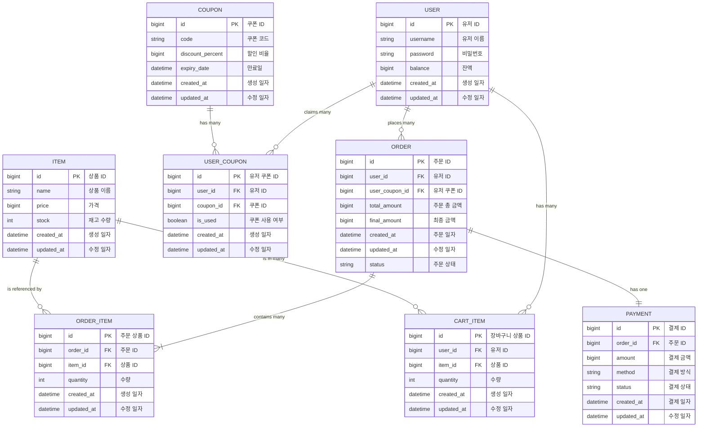

# ERD (Entity-Relationship Diagram)

아래는 이커머스 시스템의 데이터베이스 설계를 Mermaid 다이어그램으로 표현한 ERD 이다.

## **테이블 및 연관관계 설명**

---

### **1. USER 테이블**

- **설명:** 유저 정보를 저장하는 테이블
- **필드:**
    - `id` (PK): 유저 고유 식별자
    - `username`: 유저 이름
    - `password`: 유저 비밀번호
    - `balance`: 유저의 잔액
    - `created_at`, `updated_at`: 생성 및 수정 일자
- **연결 관계:**
    - **`USER ||--o{ ORDER`**: 한 명의 유저는 여러 주문을 생성할 수 있다.
    - **`USER ||--o{ USER_COUPON`**: 유저는 여러 쿠폰을 소유할 수 있다.
    - **`USER ||--o{ CART_ITEM`**: 유저는 여러 장바구니 상품 항목을 가질 수 있다.

---

### **2. ITEM 테이블**

- **설명:** 상품 정보를 저장하는 테이블
- **필드:**
    - `id` (PK): 상품 고유 식별자
    - `name`: 상품 이름
    - `price`: 상품 가격
    - `stock`: 상품 재고 수량
    - `created_at`, `updated_at`: 생성 및 수정 일자
- **연결 관계:**
    - **`ITEM ||--|{ ORDER_ITEM`**: 한 상품은 여러 주문 항목에 참조될 수 있다.
    - **`ITEM ||--o{ CART_ITEM`**: 한 상품은 여러 장바구니 상품 항목에 포함될 수 있다.

---

### **3. COUPON 테이블**

- **설명:** 쿠폰 정보를 저장하는 테이블
- **필드:**
    - `id` (PK): 쿠폰 고유 식별자
    - `code`: 쿠폰 코드
    - `discount_percent`: 할인 비율
    - `expiry_date`: 쿠폰 만료일
    - `created_at`, `updated_at`: 생성 및 수정 일자
- **연결 관계:**
    - **`COUPON ||--o{ USER_COUPON`**: 하나의 쿠폰은 여러 유저 쿠폰으로 할당될 수 있다.

---

### **4. USER_COUPON 테이블**

- **설명:** 유저와 쿠폰 간의 관계를 나타내는 테이블
- **필드:**
    - `id` (PK): 유저 쿠폰 고유 식별자.
    - `user_id` (FK): 유저 ID
    - `coupon_id` (FK): 쿠폰 ID
    - `is_used`: 쿠폰 사용 여부
    - `created_at`, `updated_at`: 생성 및 수정 일자.
- **연결 관계:**
    - **`USER ||--o{ USER_COUPON`**: 유저는 여러 쿠폰을 소유할 수 있다.
    - **`COUPON ||--o{ USER_COUPON`**: 하나의 쿠폰은 여러 유저에 의해 사용될 수 있다.

---

### **5. ORDER 테이블**

- **설명:** 주문 정보를 저장하는 테이블
- **필드:**
    - `id` (PK): 주문 고유 식별자
    - `user_id` (FK): 주문한 유저 ID
    - `user_coupon_id` (FK): 유저 쿠폰 ID (nullable)
    - `total_amount`: 주문 총 금액
    - `final_amount`: 최종 금액
    - `status`: 주문 상태
    - `created_at`, `updated_at`: 생성 및 수정 일자
- **연결 관계:**
    - **`USER ||--o{ ORDER`**: 한 유저는 여러 주문을 생성할 수 있다.
    - **`ORDER ||--|{ ORDER_ITEM`**: 한 주문은 여러 주문 항목을 포함할 수 있다.
    - **`ORDER ||--o| PAYMENT`**: 한 주문은 하나의 결제 정보를 가진다.
    - **`user_coupon_id`**: 주문에 쿠폰을 사용할 수도 있고 사용하지 않을 수도 있다.

---

### **6. ORDER_ITEM 테이블**

- **설명:** 주문된 상품 정보를 저장하는 테이블
- **필드:**
    - `id` (PK): 주문 상품 고유 식별자
    - `order_id` (FK): 주문 ID
    - `item_id` (FK): 상품 ID
    - `quantity`: 주문된 수량
    - `created_at`, `updated_at`: 생성 및 수정 일자
- **연결 관계:**
    - **`ORDER ||--|{ ORDER_ITEM`**: 한 주문은 여러 상품 항목을 포함할 수 있다.
    - **`ITEM ||--|{ ORDER_ITEM`**: 한 상품은 여러 주문 항목에서 참조될 수 있다.

---

### **7. PAYMENT 테이블**

- **설명:** 결제 정보를 저장하는 테이블
- **필드:**
    - `id` (PK): 결제 고유 식별자
    - `order_id` (FK): 결제된 주문 ID
    - `amount`: 결제 금액
    - `method`: 결제 방식 (예: 카드, 계좌이체 등)
    - `status`: 결제 상태
    - `created_at`, `updated_at`: 생성 및 수정 일자
- **연결 관계:**
    - **`ORDER ||--o| PAYMENT`**: 한 주문은 하나의 결제 정보를 가질 수 있다.

---

### **8. CART_ITEM 테이블**

- **설명:** 장바구니에 포함된 상품 정보를 저장하는 테이블
- **필드:**
    - `id` (PK): 장바구니 고유 식별자
    - `user_id` (FK): 유저 ID
    - `item_id` (FK): 상품 ID
    - `quantity`: 장바구니에 담긴 상품의 수량
    - `created_at`, `updated_at`: 생성 및 수정 일자
- **연결 관계:**
    - **`USER ||--o{ CART_ITEM`**: 유저는 장바구니에 여러 상품 항목을 담을 수 있다.
    - **`ITEM ||--o{ CART_ITEM`**: 한 상품은 여러 장바구니 상품 항목에 참조될 수 있다.

---

### **ERD 관계 요약**

- **1:1 관계:**
    - `ORDER` ↔ `PAYMENT`
- **1:N 관계:**
    - `USER` ↔ `ORDER`, `USER_COUPON`, `CART_ITEM`
    - `COUPON` ↔ `USER_COUPON`
    - `ORDER` ↔ `ORDER_ITEM`
    - `ITEM` ↔ `ORDER_ITEM`, `CART`
- **M:N 관계 (중간 테이블로 표현):**
    - `USER_COUPON` (유저와 쿠폰 간의 다대다 관계)
    - `CART_ITEM` (유저와 상품 간의 다대다 관계)
    - `ORDER_ITEM` (주문과 상품 간의 다대다 관계)