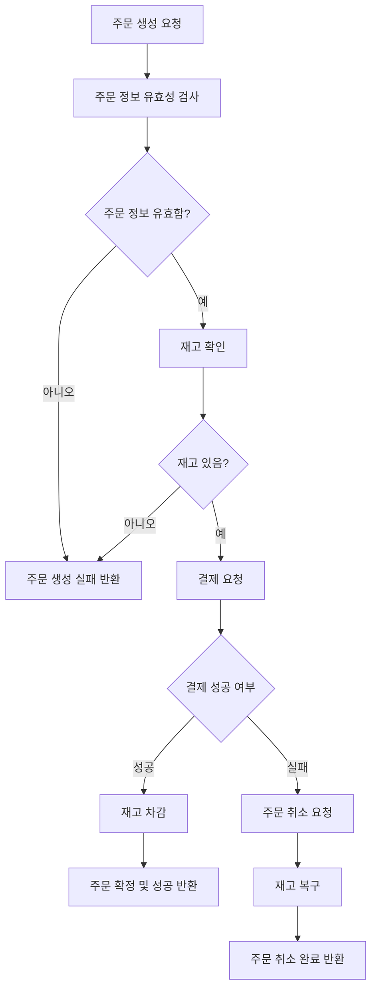

# Flow Chart

아래는 주문 및 결제 API 의 상세 플로우 차트이다.  
주문 및 결제의 성공/실패와 관련된 모든 로직과 예외 처리를 포함하였다.

### **Description**

1. **주문 생성**
    - 주문 요청을 받아 유효성 검사 수행
    - 유효하지 않으면 주문 생성 실패로 반환
2. **재고 확인**
    - 요청한 상품의 재고를 확인
    - 재고가 부족하면 실패 처리
3. **결제 요청**
    - 결제 성공 여부에 따라 분기 처리
4. **결제 성공**
    - 재고를 차감하고 주문을 확정하며 성공 응답 반환
5. **결제 실패**
    - 주문을 취소하고, 재고를 복구한 뒤 주문 취소 완료 응답 반환