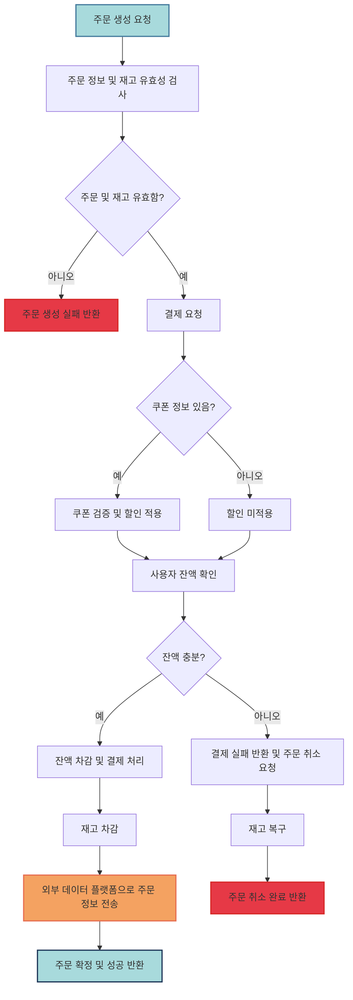

# Flow Chart

아래는 주문 및 결제 API 의 상세 플로우 차트이다.  
주문 및 결제의 성공/실패와 관련된 모든 로직과 예외 처리를 포함하였다.

### **Description**

### 1. **주문 생성 요청** (A)

- **사용자**가 주문을 요청하면 시스템은 주문 생성 프로세스를 시작합니다.

### 2. **주문 정보 및 재고 유효성 검사** (B)

- **주문 정보**가 유효한지와 함께 **재고 유무**를 동시에 확인합니다.
- **검증 결과**:
   - 주문 정보와 재고가 **유효한 경우**: 다음 단계로 진행.
   - **유효하지 않은 경우**: 주문을 **실패**하고 오류 메시지를 반환합니다.

### 3. **결제 요청** (F)

- **결제 처리**를 시작하기 전에, **쿠폰 정보**가 있는지 확인합니다.

### 4. **쿠폰 적용 여부** (M, N, O)

- **쿠폰이 있는 경우**: 쿠폰을 검증하고 **할인**을 적용합니다.
- **쿠폰이 없는 경우**: 할인 없이 결제를 진행합니다.

### 5. **사용자 잔액 확인** (G)

- **사용자 잔액**을 확인하여 **결제 가능 여부**를 체크합니다.

### 6. **잔액 확인** (P)

- **잔액이 충분한 경우**: 결제를 진행하고, 재고를 차감합니다.
- **잔액이 부족한 경우**: 결제 실패 후 **주문 취소** 요청을 보내고 재고를 복구합니다.

### 7. **재고 차감** (H)

- 결제가 완료되면 주문된 **상품의 재고를 차감**합니다.

### 8. **외부 데이터 플랫폼으로 주문 정보 전송** (R)

- **주문이 확정**되면, **실시간**으로 외부 데이터 플랫폼에 주문 정보를 전송합니다.
   - 예를 들어, 통계나 다른 시스템과의 연동을 위해 외부 플랫폼에 주문 정보를 전달합니다.

### 9. **주문 확정 및 성공 반환** (I)

- **주문이 성공적으로 완료**된 후 사용자에게 **성공 메시지**를 반환합니다.

### 10. **결제 실패 시 주문 취소 및 재고 복구** (J, K, L)

- 결제가 실패한 경우:
   - **주문 취소 요청**이 발생하며, **재고 복구**가 이루어집니다.
   - **주문 취소 완료** 메시지를 사용자에게 반환합니다.