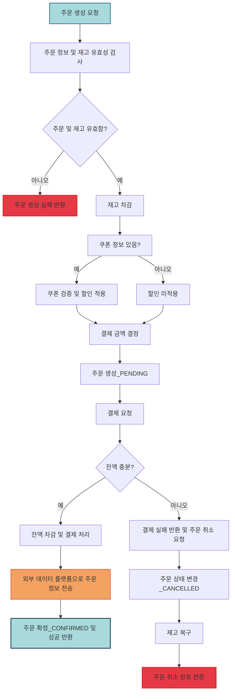

# Flow Chart

아래는 주문 및 결제 API 의 상세 플로우 차트이다.  
주문 및 결제의 성공/실패와 관련된 모든 로직과 예외 처리를 포함하였다.

### **Description**

### 1. **주문 생성 요청** (A)

- **사용자**가 주문을 요청하면 시스템은 주문 생성 프로세스를 시작합니다.

### 2. **주문 정보 및 재고 유효성 검사** (B)

- **주문 정보**가 유효한지와 함께 **재고 유무**를 동시에 확인합니다.
- **검증 결과**:
  - 주문 정보와 재고가 **유효한 경우**: 다음 단계로 진행.
  - **유효하지 않은 경우**: 주문을 **실패**하고 오류 메시지를 반환합니다.

### 3. **재고 차감** (D)

- **주문이 유효**하고, 재고도 **확인된 경우**, **주문 정보와 재고**가 문제없으면 바로 **재고를 차감**합니다.
  - 이 과정은 결제 여부와 관계없이 진행됩니다.

### 4. **쿠폰 적용 여부** (E, F, G)

- **쿠폰 정보가 있는 경우**: 쿠폰을 검증하고 **할인**을 적용합니다.
- **쿠폰이 없는 경우**: 할인 없이 결제를 진행합니다.

### 5. **결제 금액 결정** (H)

- **할인**이 적용된 **결제 금액**을 결정합니다.
  - 쿠폰을 사용하는 경우와 사용하지 않는 경우로 나뉩니다.

### 6. **주문 생성 및 결제 요청** (I, J)

- **주문 상태는 PENDING** 상태로 생성되고, **결제 요청**이 진행됩니다.

### 7. **사용자 잔액 확인** (P)

- **사용자 잔액**을 확인하여 **결제 가능 여부**를 체크합니다.

### 8. **잔액 확인** (P)

- **잔액이 충분한 경우**: 결제를 진행하고, **외부 데이터 플랫폼**에 주문 정보를 전송하여 **주문 확정** 처리합니다.
- **잔액이 부족한 경우**: 결제 실패 후 **주문 취소** 요청이 발생하며, **재고 복구**가 이루어집니다.

### 9. **외부 데이터 플랫폼으로 주문 정보 전송** (S)

- **주문이 확정**되면, **실시간**으로 외부 데이터 플랫폼에 주문 정보를 전송합니다.
  - 예를 들어, 통계나 다른 시스템과의 연동을 위해 외부 플랫폼에 주문 정보를 전달합니다.

### 10. **주문 확정 및 성공 반환** (T)

- **주문이 성공적으로 완료**된 후 사용자에게 **성공 메시지**를 반환합니다.

### 11. **결제 실패 시 주문 취소 및 재고 복구** (Q, U, V, W)

- 결제가 실패한 경우:
  - **주문 취소 요청**이 발생하며, **재고 복구**가 이루어집니다.
  - **주문 상태를 CANCELLED**로 변경하고, 사용자에게 **주문 취소 완료** 메시지를 반환합니다.