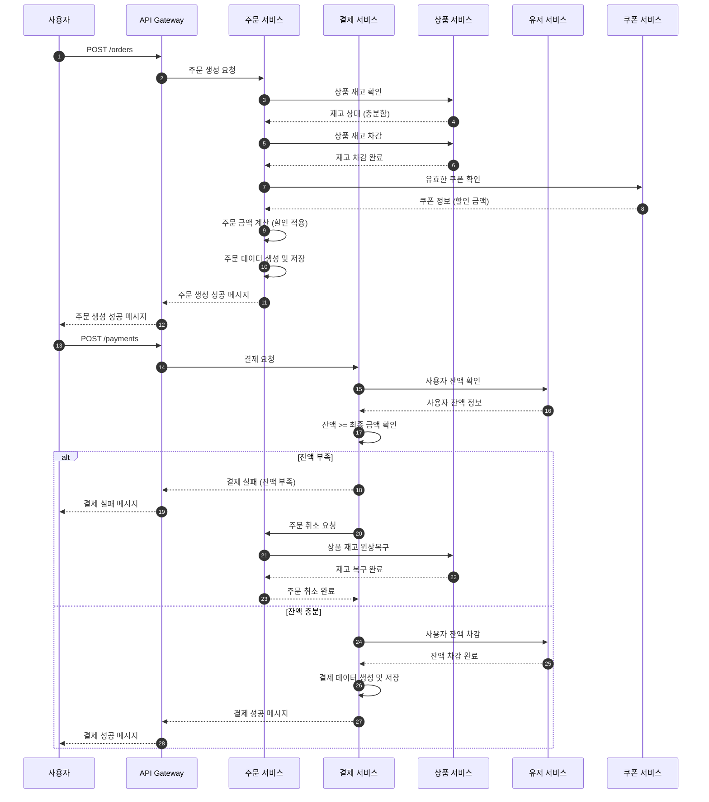

# Sequence Diagram

아래는 주문 생성과 결제 처리의 상세 로직을 포함한 시퀀스 다이어그램이다.  
서비스 내부 로직(재고 확인, 잔액 비교 등)을 나타내도록 작성되었으며, 결제 실패 시 주문 취소 및 재고 반환 로직을 포함하였다.

### **Description**

1. **주문 생성 로직**
    - API 에서 주문 생성 요청을 받으면,
        - **상품 서비스**에서 재고를 확인한다.
        - 재고가 충분하면, **상품 서비스**에서 재고를 차감한다.
    - 이후 **쿠폰 서비스**에서 쿠폰을 확인하고, 유효한 쿠폰이 있으면 할인 금액을 적용하여 최종 금액을 저장한다.
      - 계산된 금액을 바탕으로 주문 데이터를 저장하고 성공 메시지를 반환한다.
2. **결제 처리 로직**
    - **유저 서비스**에서 사용자 잔액을 확인한 후, 잔액과 최종 금액을 비교하여 결제 가능 여부를 확인한다.
    - 잔액이 부족하거나 결제 실패 상황이 발생하면,
        - **주문 서비스**에 주문 취소 요청을 보낸다.
        - **주문 서비스**는 **상품 서비스**에 상품 재고를 원상복구 요청한다.
        - **상품 서비스**에서 재고 복구를 완료하면 주문 취소가 완료된다.
    - 잔액이 충분할 경우,
        - 사용자 잔액을 차감하고 결제 데이터를 저장한 후 결제 성공 메시지를 반환한다.

### **동작 흐름 예 **

1. **성공 흐름**
    - 주문 생성 → 재고 차감 → 쿠폰 적용 → 주문 금액 계산 → 결제 성공 → 사용자 잔액 차감 → 결제 데이터 저장 → 결제 완료
2. **실패 흐름**
    - 주문 생성 → 재고 차감 → 결제 실패 → 주문 취소 → 재고 복구
